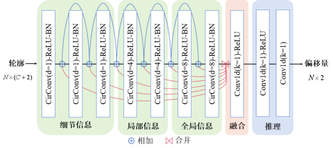

# PCENet
渐进式轮廓提取网络（Progressive Contour Extraction Network，PCENet） ，通过深度学习神经网络直接准确地输出建筑物的多边形轮廓。
### 一、技术路线
#### 1.技术路线

采取渐进式演化方法，层层递进地逐步逼近真实表达。首先，通过骨干模型获得建筑物目标的外接矩形；接着，通过顶点偏移模块完成轮廓初始化，获得建筑物目标的外接多边形；随后，通过进一步顶点偏移完成轮廓演化，获得轮廓多边形；最后，通过顶点分类模块完成轮廓简化，获得最终的简化多边形

#### 2.外接多边形
将建筑物轮廓真实值与外接多边形的交点依次连接所构成的图形定义为建筑物的外接多边形。

#### 3. 顶点偏移网络结构

### 二、安装环境：<a href="INSTALL.md">点此处</a>
### 三、获取训练集
  * whu-mix数据集下载地址：http://gpcv.whu.edu.cn/data/whu-mix%20(vector)/whu_mix(vector).html
  * aicrowd数据集下载地址：https://www.aicrowd.com/crowdai.html?rd=/challenges/mapping-challenge/dataset_files
  * 下载完毕后，在lib/datasets/dataset_catalog.py中修改数据集配置
### 四、修改配置
  - lib/config/config_whu.py ：whu-mix 数据集训练配置
  - lib/config/config_aicrowd.py:aicrowd 数据集训练配置
  - lib/config/config_ep_tp.py: 轮廓简化
### 五、训练模型：
```python
python main.py # 启动训练
```
### 六、测试结果：
```python
python test_imgs.py
```

# 七、效果图

# 八、技术支持
本文基础网络结构来自[deepsnake](https://github.com/zju3dv/snake)：

@inproceedings{peng2020deep,
  title={Deep Snake for Real-Time Instance Segmentation},
  author={Peng, Sida and Jiang, Wen and Pi, Huaijin and Li, Xiuli and Bao, Hujun and Zhou, Xiaowei},
  booktitle={CVPR},
  year={2020}
}